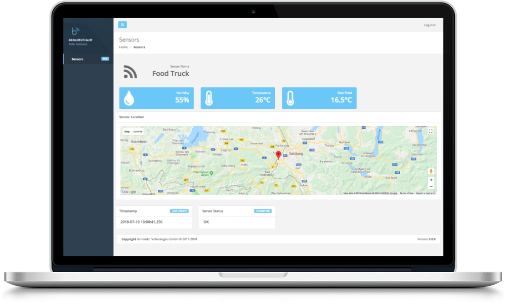
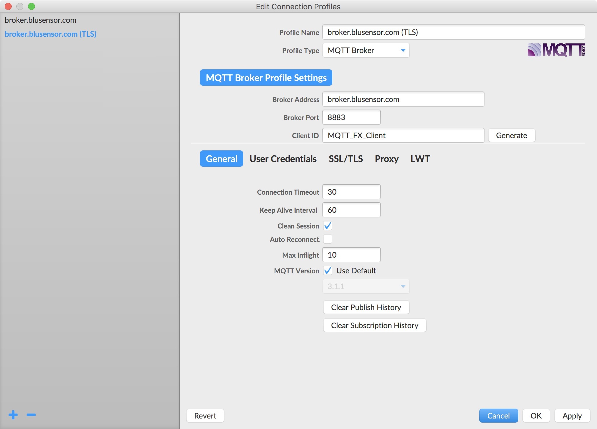
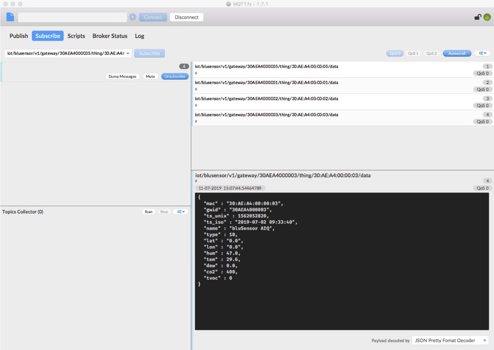

# bluSensor® MQTT API

## Broker
You can use our **shared MQTT broker** free of charge. If your project requires a **dedicated and private MQTT broker** or if you want to use your **own broker**, you can use our **app** (bluSensor AIR) to configure your sensor to connect to it. Using **TLS** and **client certificates** (stored on the sensor) is also already supported! Please contact us for details!

```
broker.blusensor.com
```

**Available Ports**

* 7883 (client)
* 7885 (websockets)
* 8883 (client,TLS)
* 8885 (websockets,TLS)

## Dashboard

We've implemented a basic dashboard to display current sensor values: https://broker.blusensor.com



## MQTT Topics

```
iot/blusensor/v1/gateway/<GWID>/thing/<MAC>/data
```

* **GWID** = world-wide unique gateway ID 
* **MAC** = world-wide uniquey sensor ID 

Example:
```
iot/blusensor/v1/gateway/001122334455/thing/00:11:22:33:44:55/data
```

## MQTT Sensor Data (json)

#### Basic Sensor Information

```
{
  
  "mac" : "00:11:22:33:44:55",
  "gwid" : "001122334455",
  "name" : “bluSensor Lab, Infinite Loop, Cupertino, CA 95014", 
  "type" : 1,
  "lat" : "37.7858340“
  "lon" : "-122.4064170",
  "ts_unix" : "1561698704",
  "ts_iso" : "2016-12-12 17:00:18.410",

  <sensor specific information>

}
```

* **mac**: sensor ID (same as topic mac) 
* **gwid**: gateway ID (same as topic gwid) 
* **name**: user defined sensor name 
* **type**: sensor type 
* **lat**, **lon**: GPS coordinates 
* **ts_unix**: UNIX timestamp of measurement 
* **ts_iso**: ISO8601 formatted timestamp of measurement 

#### Sensor Types

type         | description             
------------ | -------------           
01           | Humidity & Temperature  
02           | Accelerometer           
03           | 3D Fusion (Euler)       
04           | Air Flow                
05           | Ambient Light           
06           | Accelerometer, Magnetometer, Gyroscope 
07           | Accelerometer (Low Energy)  
08           | Shake-It Sports Tracker 
09           | Air Quality (Industrial)
10           | Air Quality 
11           | Usage Counter  
12           | Temperature Probe (PTC) 
13           | Temperature Probe (NTC) 
14           | Infrared Array Camera  
15           | Particulate Matter 
16           | Distance 
17           | Ambient Light  
18           | Highspeed Magnetometer  
19           | People Presence Detector  
20           | People Counter
21           | Distance Counter

### Sensor Specific Information

```
{
  <basic information>

  "hum" : 36.57,
  "tem" : 22.01,
  "dew" : 17.60, 
  "tvoc" : 550,
  "co2" : 1023,
}
```

sensor value            | json
------------            | -------------   
Humidity                | hum
Temperature             | tem
Temperature Probe       | tem_probe
Dewpoint                | dew
Particulate Matter      | pm1, pm2, pm4, pm10
CO2                     | co2
TVOC                    | tvoc
Air Flow                | airflow
Shake-It                | shakes_total, shakes_current
Acceleration            | acc_x / acc_y / acc_z
Gyroscope               | gyr_x / gyr_y / gyr_z
Magnetometer            | mag_x / mag_y / mag_z
3D (Euler Coordinates)  | euler_x / euler_y /euler_z
Usage Index             | uix
Light                   | light
Noise                   | noise
AIQ Index               | aiq_index, aiq_info
Pressure                | pressure
Infrared Array          | ir_cam
Distance                | distance
Distance Counter        | distance_count
People Presence         | people
People Counter          | people


## Development Tools

You can use any MQTT client to connect to our broker and subscribe to your sensor's data. 

We can recommend MQTT.fx!

#### MQTT.fx - Configuration (TLS)


#### MQTT.fx - Sensor Data (JSON)


# Purchase Sensors

You can buy sensors and development kits in our online shop at https://www.blusensor.com/shop/

# Support

Having trouble with bluSensor® API or need development support? 

You will get direct support from our **core development team** (free of charge)!

You can contact us anytime at support@blusensor.com

You need a sensor type that is not listed yet?

Just drop us an email!
