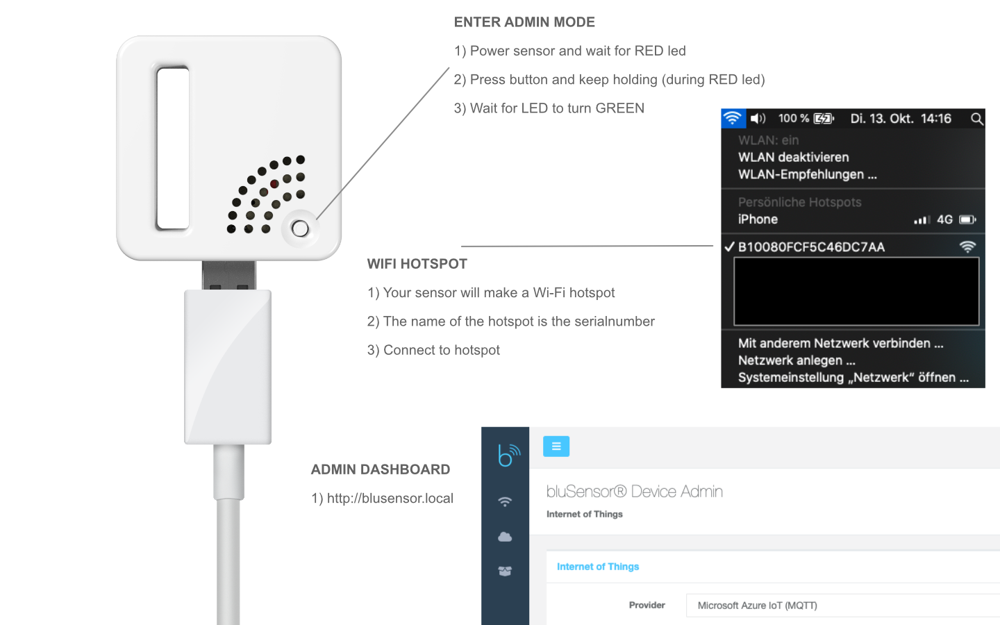
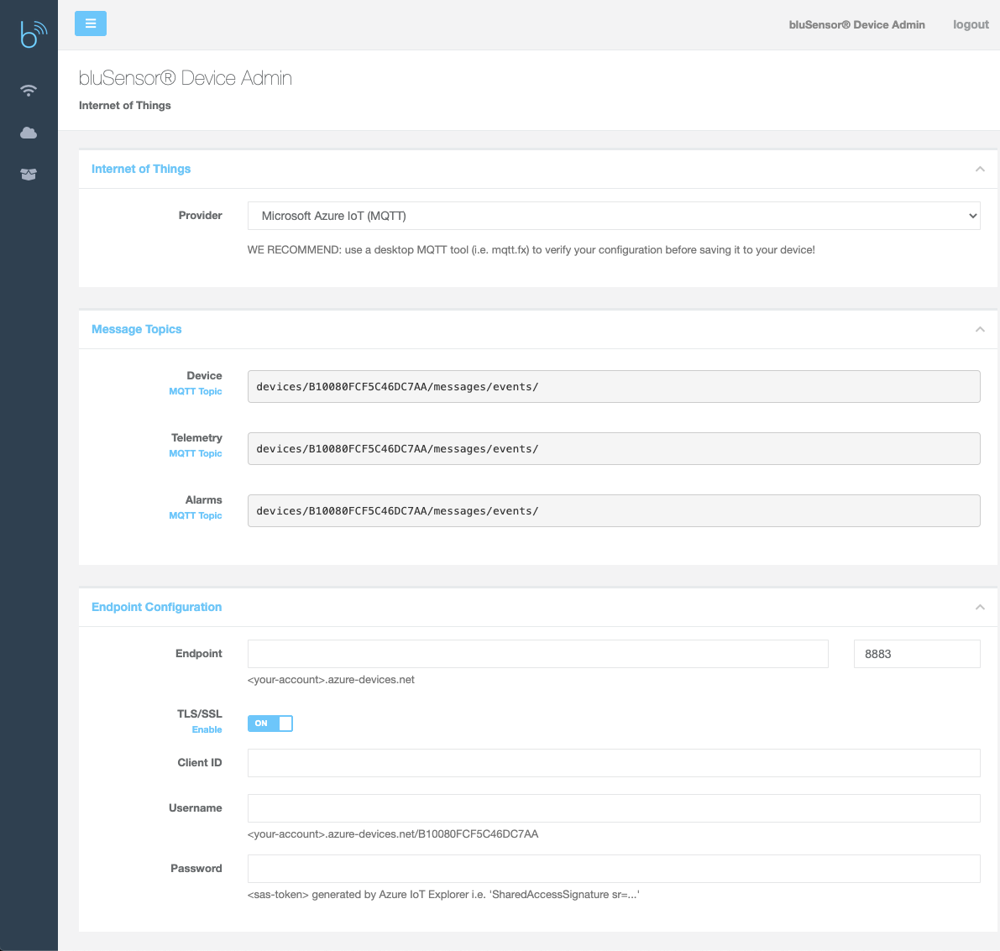
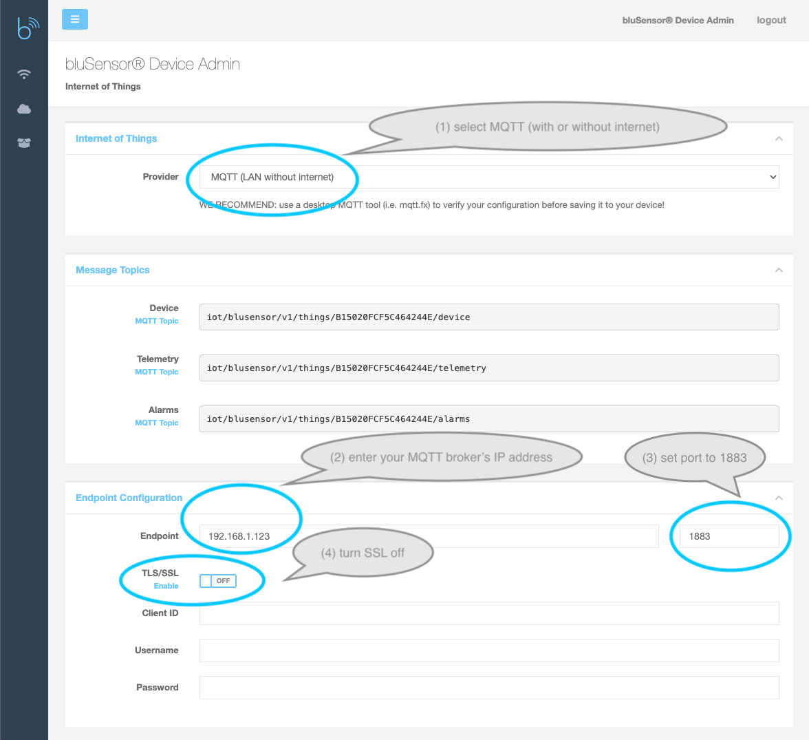
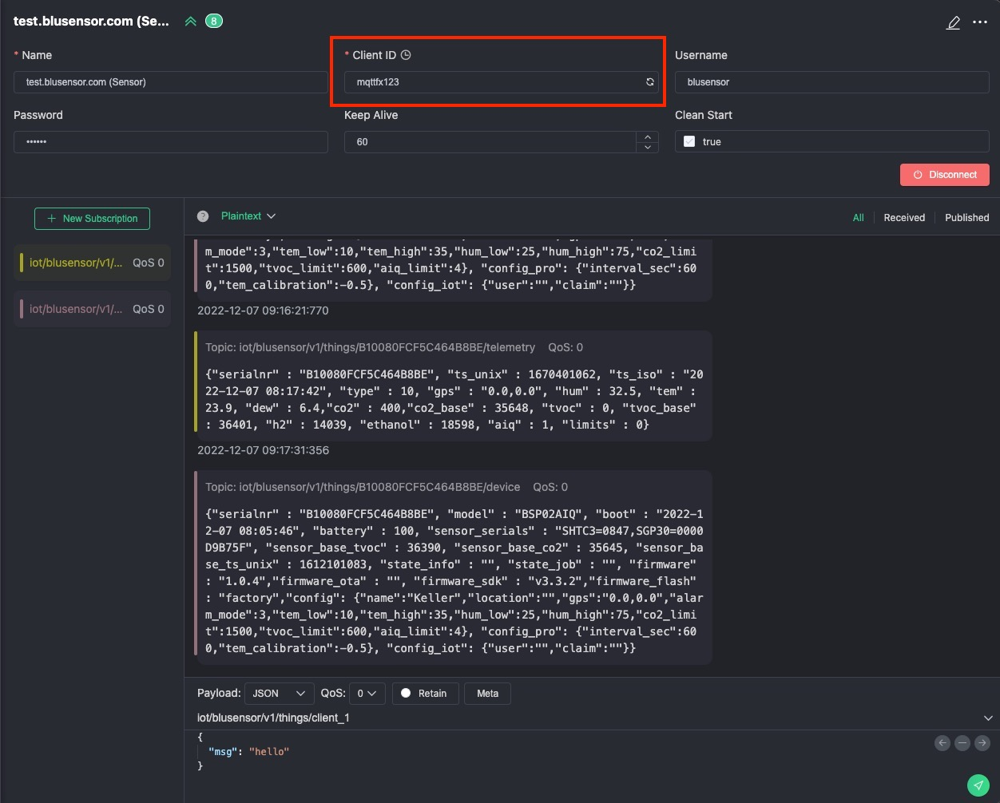
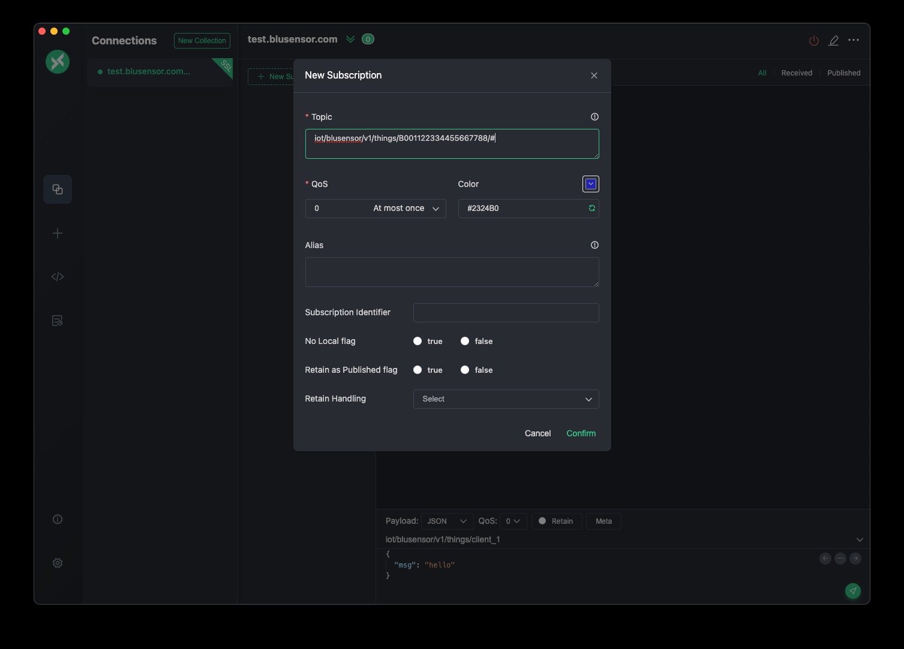

# bluSensor® MQTT API

All our Wi-Fi sensors directly support MQTT. You can also use your own MQTT broker

## Firmware

Please update to the latest firmare V1.1.0. This release contains important bugfixes for local MQTT networks.
For updating your sensors, please select "bluSensor IOT" as your IoT provider and use the iOS/Android app to trigger the firmware update.

Alternatively, you can sent the following MQTT command to your device:

TOPIC
```
iot/blusensor/v1/things/<serialnr>/control
```
MESSAGE
```
{"ota": "1.1.0"}
```

Once the sensor is starting the update, it will blink in blue.

Please note, that the sensor needs public internet access to download the firmware update.

## Sensor Setup

In order to connect a bluSensor device to your MQTT broker you need to configure the IoT connection on your sensors. In order to do so, you need to put the device into ADMIN MODE. The device will make a Wi-Fi hotspot (name=serialnumber) that you can connect to.

Once connected you can open the URL: http://192.168.4.1

Select the menu item "Internet of Things" to configure your sensor. Next select "MQTT" as your provider and fill out the "Endpoint Configuration". 

Once your configuration is finished, you need to restart the device. You can check our iOS/Android app for connection states. Detailed informations can be found on the sensor's information page.


## Enter Admin Mode 

The default password is "123456", but you can change that anytime.



## Configure Internet of Things 



## Configure Wi-Fi on your sensor
You need to connect your sensor to a Wi-Fi network. This can be done on the first page of the admin dashboard or you can use our app for iOS and Android

## MQTT broker "mosquitto" default config
If you are using mosquitto with its default configuration (non-TLS) you need to configure your sensor like this



## Sensor Interval

The sensor will send updates every 60 seconds.

## MQTT Topics

```
iot/blusensor/v1/things/<SERIALNR>/telemetry
iot/blusensor/v1/things/<SERIALNR>/device
iot/blusensor/v1/things/<SERIALNR>/alarms
```

* **SERIALNR** = world-wide unique sensor serialnumber (18 characters)


Example:
```
iot/blusensor/v1/things/B01080112233445566/telemetry
iot/blusensor/v1/things/B01080112233445566/device
iot/blusensor/v1/things/B01080112233445566/alarms
```

## MQTT Sensor Data (json)

#### Basic Sensor Information

```
{
  
  "serialnr" : "B01080112233445566",
  "name" : “bluSensor, Infinite Loop, Cupertino, CA 95014", 
  "location" : "bluSensor Lab Room 1"
  "type" : 1,
  "lat" : "37.7858340“
  "lon" : "-122.4064170",
  "ts_unix" : "1561698704",
  "ts_iso" : "2016-12-12 17:00:18.410",

  <sensor specific information>

}
```

* **serialnr**: sensor serialnumber
* **name**: user defined sensor name 
* **location**: user defined sensor location
* **type**: sensor type 
* **lat**, **lon**: GPS coordinates 
* **ts_unix**: UNIX timestamp of measurement (UTC)
* **ts_iso**: ISO8601 formatted timestamp of measurement (UTC)


#### Device Types

device type  | description             
------------ | -------------           
01           | Humidity & Temperature  
02           | (reserved)           
03           | 3D Fusion (Euler)       
04           | Air Flow                
05           | (reserved)           
06           | (reserved) 
07           | Accelerometer, Magnetometer, Gyroscope 
08           | (reserved)
09           | (reserved)
10           | Air Quality 
11           | Usage Counter  
12           | (reserved)
13           | Temperature
14           | Infrared Array Camera  
15           | Particulate Matter 
16           | Proximity Distance 
17           | Light Ambient
18           | Magnetometer
19           | People Detection
20           | (reserved)
21           | Proximity Counter


### Sensor Specific Information

```
{
  <basic information>

  "hum" : 36.57,
  "tem" : 22.01,
  "dew" : 17.60, 
  "tvoc" : 550,
  "co2" : 1023,
}
```

sensor value            | json
------------            | -------------   
Humidity                | hum
Temperature             | tem
Temperature Probe       | tem_probe
Dewpoint                | dew
Particulate Matter      | pm1, pm2, pm4, pm10
CO2                     | co2
TVOC                    | tvoc
Air Flow                | airflow
Shake-It                | shakes_total, shakes_current
Acceleration            | acc_x / acc_y / acc_z
Gyroscope               | gyr_x / gyr_y / gyr_z
Magnetometer            | mag_x / mag_y / mag_z
3D (Euler Coordinates)  | euler_x / euler_y /euler_z
Usage Index             | uix
Light                   | light
Noise                   | noise
AIQ Index               | aiq
Pressure                | pressure
Infrared Array          | ir_cam
Distance                | distance
Distance Counter        | distance_count
People Presence         | people
People Counter          | people


## Public MQTT Broker
You can use our **public MQTT broker** free of charge. If your project requires a **dedicated and private MQTT broker** or if you want to use your **own broker**, you can use our **app** (bluSensor® AIR) to configure your sensors to connect to it. Using **TLS** and **client certificates** (stored on the sensor) is also already supported! Please contact us for details!

```
test.blusensor.com
```

**Available Ports**

```
8883 (TLS)
8081 (websockets,TLS)
```

The shared MQTT broker only support TLS connections and user authentication is mandatory from now on.

```
user=blusensor
pass=123456
```

You need to use the serialnumber of your sensor as the client ID

```
client_id=<serialnr>
```

Any device connected to the broker can only subscribe and publish to its own topic

```
iot/blusensor/v1/things/<client_id>/#
```

Our legacy public broker.blusensor.com will be running until 30.11.2022. 

## Development Tools

You can use any MQTT client to connect to our broker and subscribe to your sensor's data. 

Note: do not use the same client id as your sensor! The broker only supports one connection per client ID.

We can recommend MQTT X!
https://mqttx.app/

#### MQTT X - Configuration (Broker)


#### MQTT X - Sensor Data (Topics)



# Support

Having trouble with bluSensor® API or need development support? 

You will get direct support from our **core development team** (free of charge)!

You can contact us anytime at support@blusensor.com

You need a sensor type that is not listed yet?

Just drop us an email!
